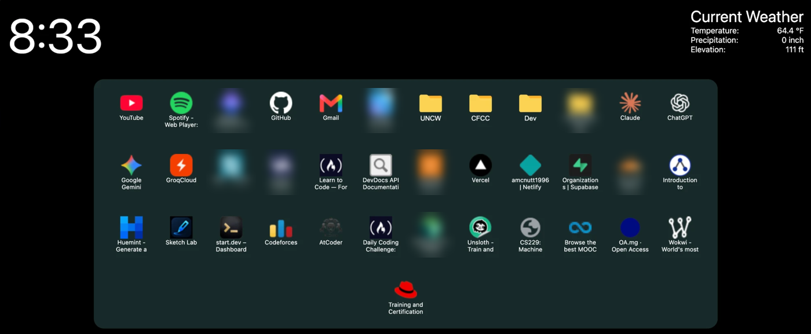
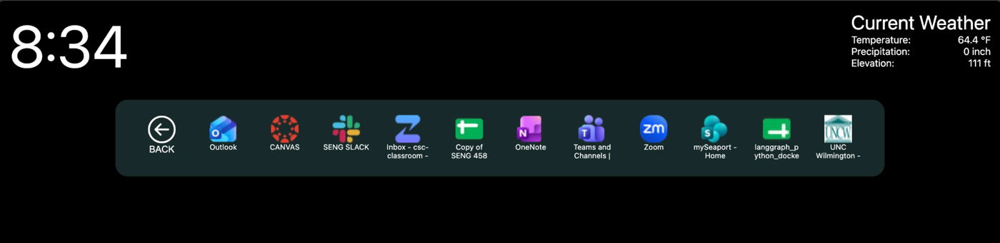

# Chromium Bookmarks New Tab

A Manifest V3 browser extension that replaces the Chromium new tab page with your Bookmarks Bar in the middle of the screen, Safari-style, plus a clock and local weather.

I got frustrated that Brave's new tab page couldn't put my bookmarks front and center the way Safari does, so I built this to override it.

## What it does
- Shows everything on your **Bookmarks Bar** as a grid with favicons.
- Lets you open folders and step back out with a back button.
- Shows a live clock and the current weather for your approximate location.
- Works in any Chromium browser (Brave, Chrome, Edge, …).

## Tech stack
Vanilla JavaScript (ES modules) · HTML/CSS · Chrome Extensions Manifest V3 (`chrome_url_overrides`, `bookmarks`, `favicon`) · ip-api.com · Open-Meteo

## How it works
- `manifest.json` overrides `newtab` with `customHome.html` and requests the `bookmarks`, `storage` and `favicon` permissions.
- `bookmarks.js` reads the tree with `chrome.bookmarks.getTree()` and builds the grid from the Bookmarks Bar node. Folders re-render the grid with their children and keep a back stack.
- Favicons come from the extension's built-in `/_favicon/` endpoint, so the page never fetches from the sites themselves.
- `weather.js` gets an approximate location from ip-api.com, then fetches current conditions from Open-Meteo. Neither API needs a key.

## Install (load unpacked)
1. `git clone https://github.com/amcnutt1996/chromium-bookmarks-newtab.git`
2. Open your browser's extensions page (`chrome://extensions`, `brave://extensions`, …) and turn on **Developer mode**.
3. Click **Load unpacked** and select the `chromium-bookmarks-newtab` folder.
4. Open a new tab. Some browsers show a footer you may need to disable.

## What I learned
- How Manifest V3 extensions declare page overrides and permissions, and how little code it takes to change core browser UI.
- Turning a recursive data structure (the bookmark tree) into navigable UI state.

## License
[MIT](LICENSE)
